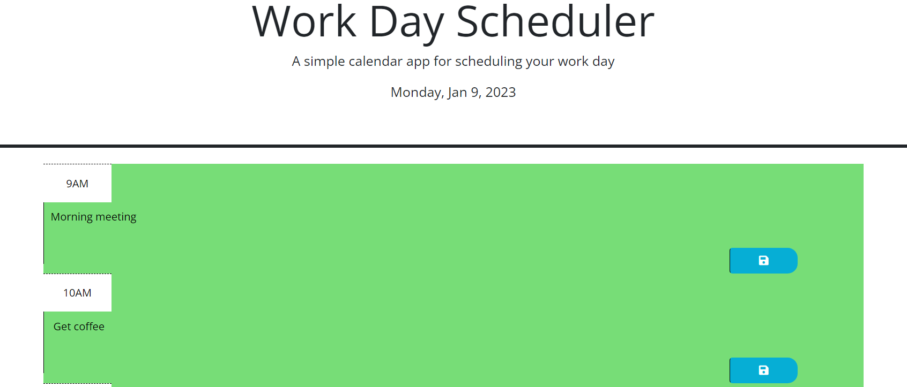

# work-day-scheduler

## Description

In this project, I coded a work scheduler using data from the dayjs API, JQuery, bootstrap css framework, for loops, event listeners, and text data stored on local storage.

## Installation

N/A

## Usage

To use, open the webpage in the browser. The header should display the program title, a short description, and the current day and date. The current hour will be highlighted in gray, the past hours will be red, and future hours will be green. Type your schedule to-dos in the textbox corresponding to the hour and hit the save button on the right side of the box to save the submission.

## Credits
N/A

## License

PLease refer to the license in the repo